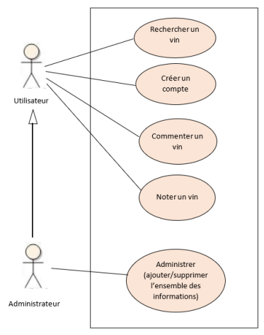
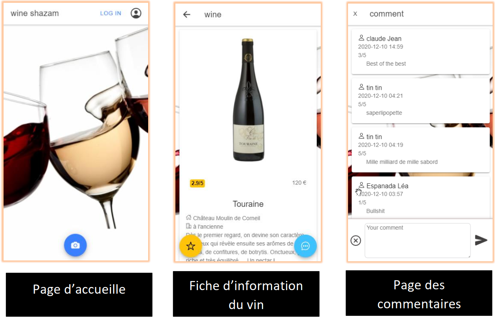

# wine_shazam [Front-End]
Récupération d'inforamtion sur une bouteille en scannant son étiquette
## Fonctionalité
- Recherche de vin en scannant l'étiquette de la bouteille (OCR)
- Commenter un vin
- Noter un vin
- Enregistrement / Authentification
- Admninistrer

## Screenshot

## Techologie

